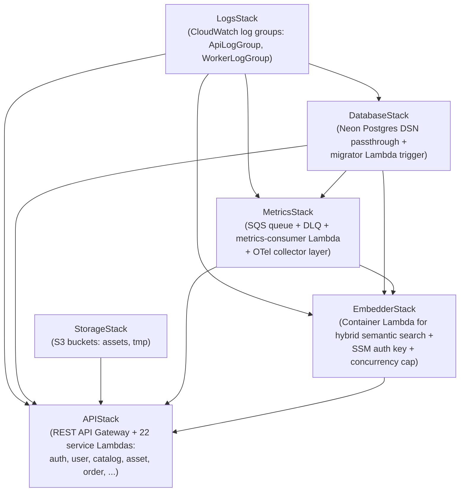
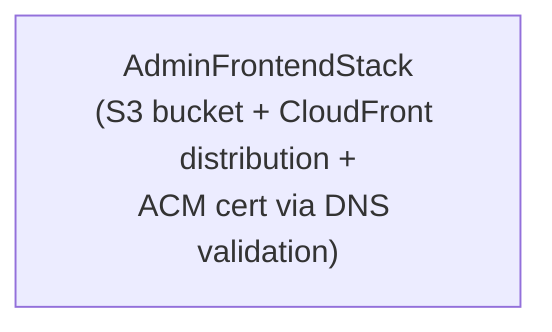
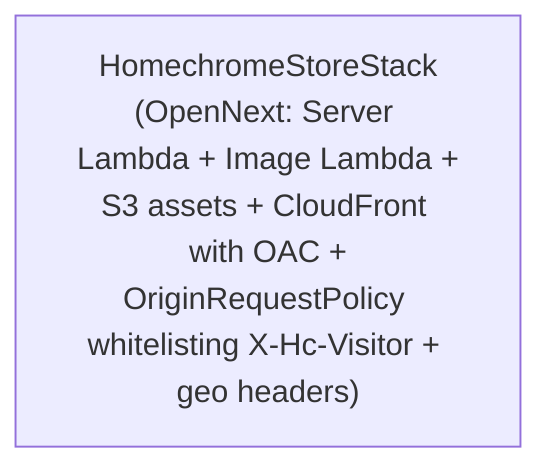

# Infrastructure stack dependency DAG

Three independent CDK apps live in the repo, one per deployable. Each app
declares its own stacks; cross-app dependencies are zero (all wiring is
internal to a single app).

| App | Path | Stacks |
|---|---|---|
| Backend | `handloom-admin/infra/cmd/main.go` | 6 stacks (see below) |
| Admin frontend | `handloom-admin-frontend/infra/` | 1 stack (CloudFront + S3) |
| Storefront | `homechrome-store/infra/cmd/main.go` | 1 stack (OpenNext: CF + Server Lambda + Image Lambda + S3) |

---

## Backend (`handloom-admin/infra`)

Six stacks. Top-to-bottom is the construction order in `cmd/main.go` —
each stack's listed dependencies must already exist before it can be
constructed.



### Dependency table (backend)

| Stack | Depends on | Why |
|---|---|---|
| **LogsStack** | — | Owns the shared CloudWatch log groups (`ApiLogGroup`, `WorkerLogGroup`). Every Lambda routes its logs here so retention + IAM stay single-source. |
| **StorageStack** | — | S3 buckets for product images + the `tmp/`-then-`assets/` finalisation flow. Self-contained. |
| **DatabaseStack** | LogsStack | Wraps Neon Postgres DSN passthrough + a `triggers.Trigger` that fires the migrator Lambda on each deploy. Migrator writes to ApiLogGroup. |
| **MetricsStack** | LogsStack, DatabaseStack | SQS queue + DLQ that buffer metric events; consumer Lambda reads SQS → PG `metric_counters`. Needs PG conn for writes + ApiLogGroup for logs + OTel layer for Loki shipment. |
| **EmbedderStack** | LogsStack, DatabaseStack, MetricsStack | Container Lambda (ONNX + ORT). Connects to Postgres for product embeddings; emits `search_query` to `MetricsStack.Queue`; logs to ApiLogGroup. |
| **APIStack** | LogsStack, DatabaseStack, StorageStack, MetricsStack, EmbedderStack | The big one: 22 service Lambdas (auth, user, catalog, asset, order, inventory, pricing, notification, audit, coupon, report, store-*, worker-embedding-backfill) + API Gateway. Wires every Lambda env var + IAM grant. |

### Construction order rule

Always: `LogsStack` → `StorageStack` (parallel) → `DatabaseStack` →
`MetricsStack` → `EmbedderStack` → `APIStack`.

Reordering breaks at synth time because each later stack reads a public
field (`stack.LogGroup`, `stack.Queue`, `stack.Function`) off an earlier
stack's struct.

---

## Admin frontend (`handloom-admin-frontend/infra`)

Single stack — pure static-asset hosting.



No CDK-level dependency on the backend app. The admin SPA talks to the
backend at runtime via `dev-api.homechrome.in` / `api.homechrome.in`
(set in `.env.dev` / `.env.prod` as `VITE_API_URL`).

---

## Storefront (`homechrome-store/infra`)

Single stack — OpenNext deploys the Next.js app as Server Lambda +
Image Lambda + S3 statics behind one CloudFront distribution.



No CDK-level dependency on backend. Storefront proxies `/api/*` to the
backend API Gateway via Next.js rewrite at request time
(`NEXT_PUBLIC_API_URL`).

---

## Cross-app runtime wiring (not CDK deps)

Even though the three apps are independent at CDK level, they call each
other at runtime:

```mermaid
graph LR
    Browser -->|"site visit"| StoreCF["Storefront CloudFront"]
    StoreCF -->|"SSR + API rewrite"| ServerLambda["Server Lambda<br/>(Next.js)"]
    ServerLambda -->|"/api/* rewrite<br/>X-Hc-Visitor merged"| BackendAPIGW["Backend API Gateway"]
    BackendAPIGW --> AuthLambda["auth/user/catalog/order/...<br/>(22 service lambdas)"]
    AuthLambda -->|"metric events"| MetricsSQS["MetricsStack SQS"]
    MetricsSQS --> MetricsConsumer["metrics-consumer Lambda"]
    MetricsConsumer --> Neon[("Neon Postgres<br/>metric_counters")]
    Admin["Admin SPA<br/>(CloudFront + S3)"] -->|"Data API: /rest/v1/*"| Neon
    Admin -->|"admin endpoints"| BackendAPIGW
    AuthLambda -.->|"/api/v1/store/catalog/search"| Embedder["EmbedderStack Lambda"]
    Embedder -->|"search_query"| MetricsSQS
```



---

## Deploy order

```bash
# Backend (one command, deploys all 6 stacks in dependency order)
cd handloom-admin && make cdk-deploy-dev

# Admin frontend
cd handloom-admin-frontend && npm run cdk:deploy:dev

# Storefront
cd homechrome-store && npm run cdk:deploy:dev
```

Within each app CDK figures out stack order itself from the dep graph.
Across apps the order doesn't matter for synth — only for first-time
provisioning of a brand-new environment, where you'd want backend up
first so the storefront's `NEXT_PUBLIC_API_URL` and the admin's
`VITE_API_URL` resolve.
